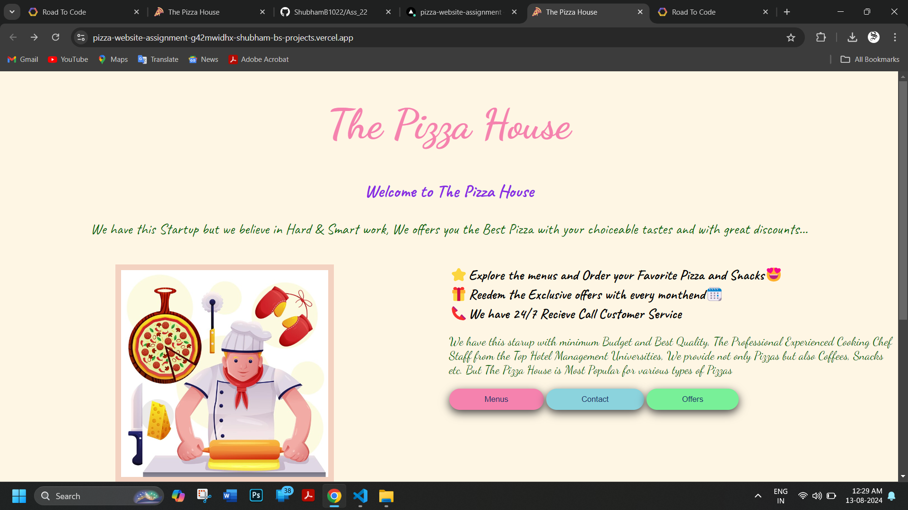

# Assignment 22 (Created Website using HTML and Basics of CSS)

Assignment 22 given by Rode to Code (RTC) to create a website using HTML and Basics CSS on any topic of the following.

1. Bakery Website
2. Sweet Shop
3. Pizza Store
4. Restaurant
5. Cafe
6. Grocery Store
7. Fruit Shop
8. Juice Center

`I have Choosed 3. Pizza Store`
   ---
 I have used Basic HTML tags following:
 - head tag
 - body tag
 - div tag
 - img tag
 - anchor tag
 - headings tag
 - telephonic attribute
 - mailto attribute
 - paragraph tag
 - button tag
  ---
  I have used Basic CSS following:
  - class selector
  - external css files for individual pages
  - border and border radius
  - padding
  - margin
  - background-color
  - height & width
  - box shadow
  - hover effect
  - font family (implemented from google fonts)
  - text-alignments
  - display properties
  - flexboxes
  - utility classes
   ---
   
   ---
 [Click here to visit Hosted Website](https://pizza-website-assignment-g42mwidhx-shubham-bs-projects.vercel.app/)

   